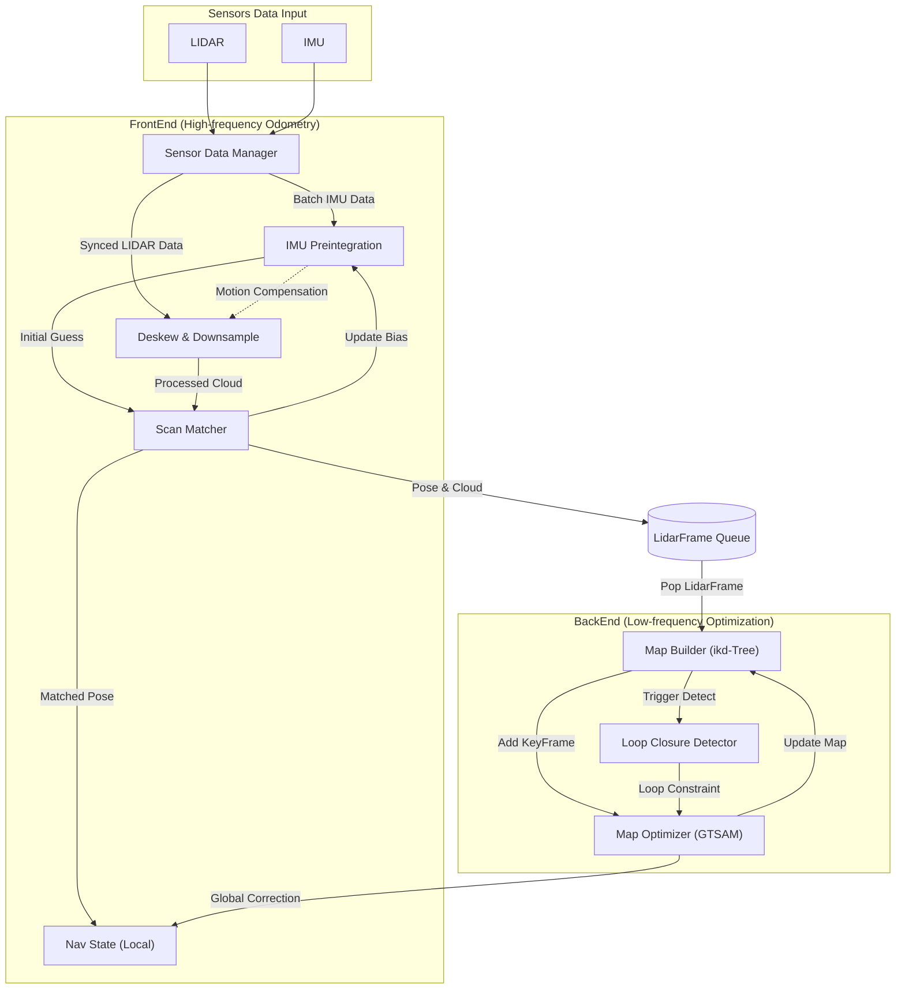

# lio_slam_shaw

**lio_slam_shaw** is an efficient, robust, and highly extensible tightly-coupled LiDAR-Inertial Odometry and Mapping framework.

Built with modern software engineering principles in mind, this project transcends a single, rigid algorithm. Instead, it provides a deeply refactored, multi-threaded architecture focused on **system scheduling** and **interface abstraction**. By utilizing a custom `SlamProcessor` state machine and strict read-write locks, the system ensures seamless collaboration between the front-end odometry and back-end optimization, providing a solid foundation where state-of-the-art SLAM modules can be easily integrated, evaluated, and switched.

## 🌟 Key Features & Technical Highlights

* 🧩 **Plug-and-Play Modular Architecture**
  Designed with strict Interface Segregation (e.g., `ILoopClosureDetector`, `IMapBuilder`), the framework allows developers to hot-swap core components. You can effortlessly switch between an `ikd-Tree`-based Point-to-Plane detector for extreme speed, or a classic `PCL ICP`-based detector (inspired by LIO-SAM) to validate system reliability across different back-end configurations.
* 🛡️ **Enterprise-Grade Thread Safety**
  The core `SlamProcessor` implements rigorous data queues and read-write locks (`std::shared_mutex`). This completely resolves the race conditions between background map incremental updates and high-frequency front-end map queries—a common pain point in modern LIO systems.
* 🔄 **Spatiotemporally Isolated Loop Closure Sandbox**
  Features a unique "independent sandbox" loop closure architecture. Regardless of which detection module is plugged in, the framework strictly enforces **temporal scale filtering** and **spatial history reconstruction** when building local maps. This eradicates "trivial matches" and trajectory ghosting, ensuring the absolute purity of the GTSAM pose graph.
* 🚀 **Agnostic & High-Frequency Front-End**
  Supports tightly-coupled IMU preintegration for point cloud deskewing and motion compensation. The front-end matcher is decoupled from the specific data structure, allowing it to run at a blazing 50Hz while feeding mathematically exact covariance constraints ($H^{-1}$) to the back-end.

## 🛠️ Dependencies
* **C++17** or higher
* **Eigen3** (Matrix operations & optimization core)
* **PCL** (Point cloud data structures & voxel filtering)
* **GTSAM 4.2.0** (Pose Graph global optimization)

## 🙏 Acknowledgements
This framework is built upon the shoulders of giants. We sincerely thank the authors of the following outstanding open-source projects and academic papers, whose components and concepts heavily inspired this work:

* **[FAST-LIO2 / ikd-Tree]**: Tremendous thanks to the **Mars Lab at the University of Hong Kong (HKU)** for their groundbreaking work on the incremental KD-Tree (`ikd-Tree`), which powers our high-speed dynamic mapping.
* **[LIO-SAM]**: Deep appreciation to **Tixiao Shan** for his pioneering work in factor-graph-based tightly-coupled LIO architectures, which inspired our ICP-based validation modules.
* **[GTSAM]**: Thanks to the **Georgia Tech** Borg Lab for providing the robust factor graph optimization backend.

## Flow chart

